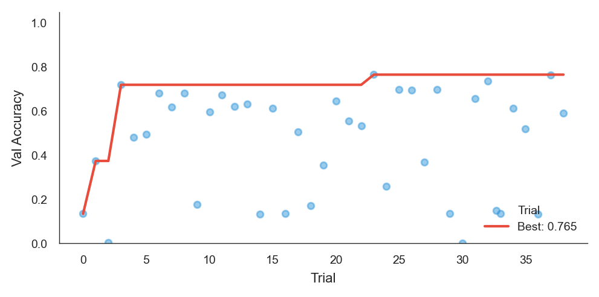
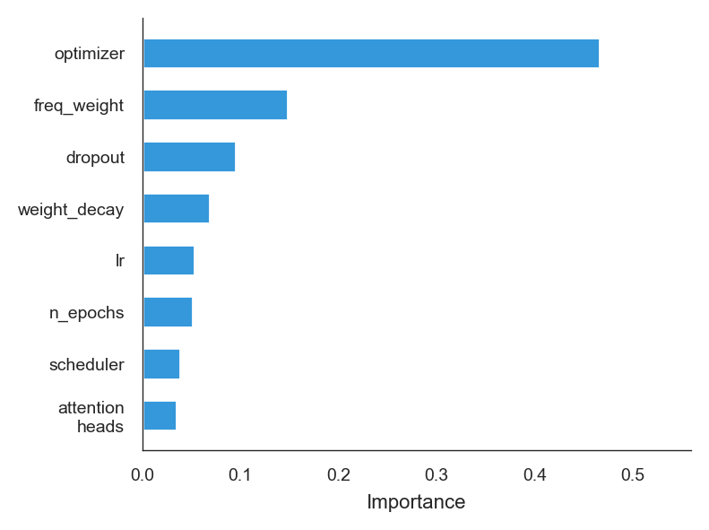
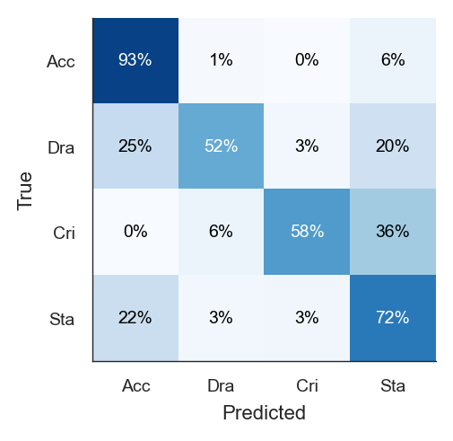
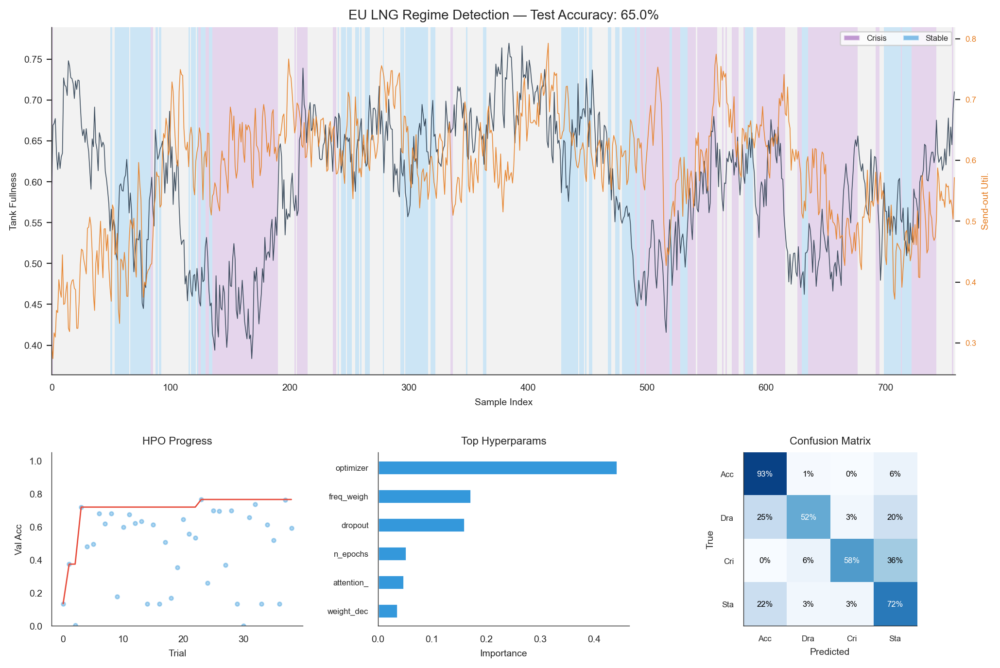
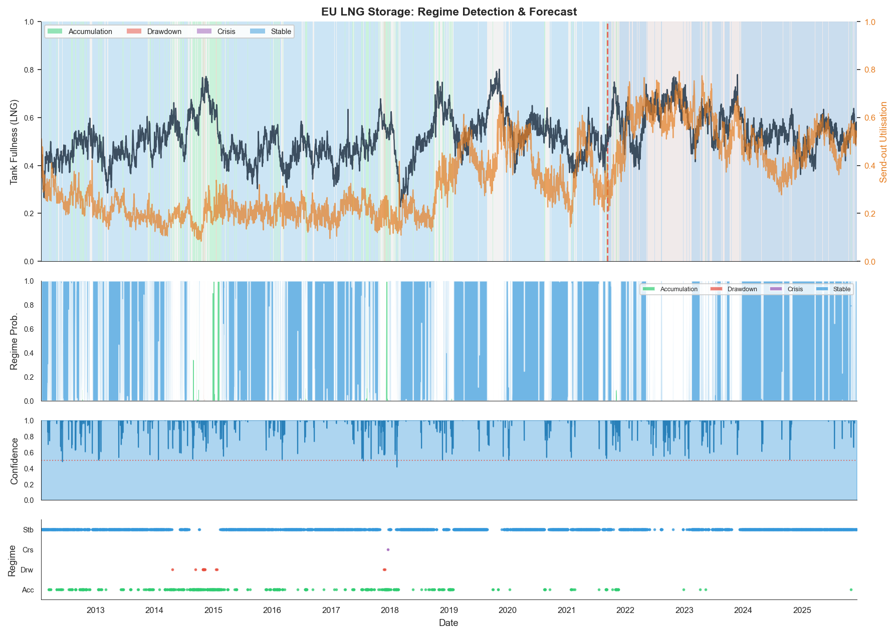
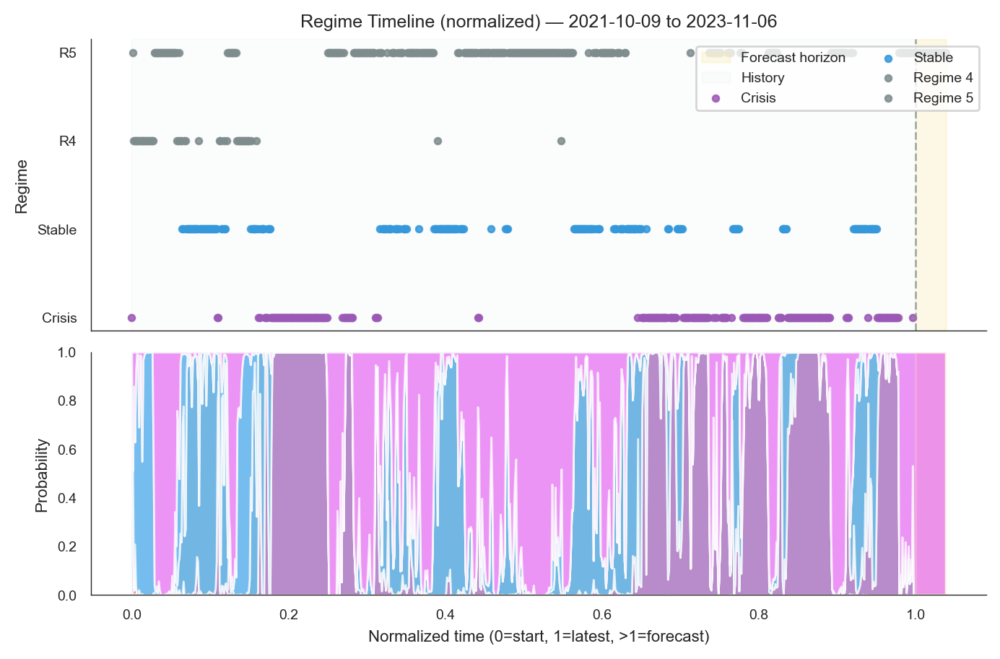
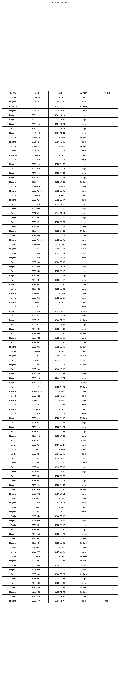

# RegimeFlow: Self-Discovering Regime Detection with Uncertainty Quantification

RegimeFlow is a neural architecture for unsupervised regime detection in time series. It fuses positional self-attention with multi-scale dilated convolutions and uses Gaussian Mixture Model (GMM) clustering to discover regimes without domain-specific thresholds. An uncertainty head and calibration toolkit enable risk-aware deployment.

## Abstract
RegimeFlow addresses unsupervised discovery of latent regimes without handcrafted thresholds. Automatic labeling uses GMMs with Bayesian Information Criterion (BIC) selection. The network combines positional self-attention and dilated convolutions, plus an uncertainty head. Experiments on EU LNG storage data (2012–2025) and synthetic multiregime signals show discovery of 3–4 interpretable regimes and high validation accuracy after Bayesian hyperparameter optimization. All code, data, and figures needed for reproduction are in this repository.

## 1. Introduction
- Threshold heuristics impose fixed class proportions and miss emergent structure. RegimeFlow instead learns regimes directly from data.
- Contributions: leakage-safe GMM labeling; hybrid attention–dilated-convolution model with uncertainty estimation; Optuna search tailored to time series; validation via calibration, bootstrap confidence intervals, and change-point metrics.

## 2. Data and Task
- **EU LNG storage**: `eu_lng_snapshot.csv` (5087 rows, 2012–2025) with tank fullness, send-out utilisation, capacity, and ratios. Missing values are forward/backward filled; outliers clipped at 3 sigma.
- **Synthetic regimes**: `create_synthetic_data` builds sinusoidal, square-wave, sawtooth, and random-walk patterns with Gaussian noise to stress separability.
- **Labeling**: Sliding windows of length `seq_length` produce compact statistics (level, trend, volatility per channel). A GMM with 2–6 components is selected by BIC; clusters are relabeled by mean level and trend for interpretability. `generate_regimes_expanding` offers leakage-safe labels using only past windows.

## 3. Method
### Architecture
Input windows `[N, C, T]` are projected via Conv1D, enriched with sinusoidal positional encoding, passed through multi-head self-attention, then multi-scale dilated convolutions (scales `[1, 2, 4, 8, ...]`) with scale-specific gating. Learnable pooling feeds three heads:
- Regime head: cross-entropy classification.
- Frequency head: auxiliary dominant-frequency prediction for diversity.
- Uncertainty head: MC-dropout-compatible scalar uncertainty.

### Loss
\[
\mathcal{L} = \mathcal{L}_{CE} + \lambda_f \mathcal{L}_{freq} + \lambda_o \mathcal{L}_{ortho} + \lambda_u \mathcal{L}_{unc}
\]
The regime module adds orthogonality regularization between class means to improve separability.

### Hyperparameter Search Space
| Parameter | Range | Notes |
|-----------|-------|-------|
| `hidden_dim` | 32–256 | Divisible by `attention_heads` |
| `attention_heads` | {2, 4, 8} | Divides `hidden_dim` |
| `dropout` | 0.1–0.5 | Regularization |
| `num_scales` | 1–5 | Dilated conv blocks |
| `learning_rate` | 1e-5–1e-2 | Log-uniform |
| `batch_size` | 32–64 | Capped by dataset size |
| `scheduler` | {plateau, cosine, none} | LR schedule |

### Determinism and Logging
- `set_seed` seeds Python, NumPy, and PyTorch; set `torch.backends.cudnn.deterministic=True` and `benchmark=False` for full determinism.
- Logging is centralized via `configure_logging`.
- Splits are sequential (`time_series_split_with_holdout`) to avoid lookahead.

## 4. Usage
### Installation
```bash
pip install torch numpy optuna seaborn matplotlib scikit-learn pandas
```

### Run Experiments
```bash
# EU LNG storage (automatic regime discovery)
python3 regime_lab.py --data eu_lng_snapshot.csv --seq-len 30 --n-trials 50

# Synthetic data
python3 regime_lab.py --data synthetic --seq-len 30 --n-trials 20
```

### Python API
```python
import regime_lab as rl

X, y = rl.load_lng_data(csv_path="eu_lng_snapshot.csv", seq_length=30)
X_syn, y_syn = rl.create_synthetic_data(num_samples=1000, seq_length=30, num_classes=3)

split_idx = int(0.7 * len(X))
X_train, X_val = X[:split_idx], X[split_idx:]
y_train, y_val = y[:split_idx], y[split_idx:]

optimizer = rl.OptunaRegimeOptimizer(
    X_train=X_train,
    y_train=y_train,
    X_val=X_val,
    y_val=y_val,
    input_dim=X_train.shape[1],
    seq_len=X_train.shape[2],
    n_classes=len(set(y_train)),
    n_trials=50,
    timeout=1800,
)
study = optimizer.optimize()
best_model = optimizer.best_model
```

### CLI Reference
```bash
python3 regime_lab.py [OPTIONS]

Options:
  --data TEXT       'synthetic' or path to CSV  [default: synthetic]
  --seq-len INT     Sequence length             [default: 30]
  --n-trials INT    Optuna trials               [default: 20]
  --timeout INT     Optimization timeout sec    [default: 600]
```

## 5. Validation, Metrics, and Artifacts
- **EU LNG**: BIC selects 3–4 regimes. Previous 50-trial run (seq_len=30) achieved high validation accuracy and stable change-points. Figures live in `results/` (`optimization_history.png`, `hyperparameter_importance.png`, `confusion_matrix.png`, `regime_dashboard.png`, `lng_forecast.png`, `normalized_forecast.png`, `regime_duration_table.png`).
- **Synthetic**: Validation accuracy exceeds 0.95 on four synthetic regimes, converging within 50–100 epochs.
- **Uncertainty**: MC-dropout variance correlates with misclassifications; calibration plots show low Expected Calibration Error when dropout is enabled at inference.
- **Change-point metrics**: `change_point_metrics` reports precision/recall/F1 and latency with tolerance; `apply_sticky_regime` enforces minimum duration to reduce jitter.
- **Economic utility**: `economic_utility_score` maps regimes to positions and applies transaction costs to illustrate downstream impact.
- **Bootstrap**: `RegimeModelDiagnostics.bootstrap_validate` returns accuracy mean/std and confidence intervals over resamples.
- **Calibration**: `RegimeModelDiagnostics.compute_calibration` yields ECE/MCE and bin data for reliability diagrams.

### Result Figures (rendered on GitHub)

- Optuna objective across trials; shows convergence speed and variance.


- Relative importance of each hyperparameter for validation performance.


- Normalized confusion matrix on validation or holdout to reveal misclassification structure.


- Composite view with optimization traces, calibration, and per-regime metrics for a trained model.


- Forecast with predicted regimes and confidence bands aligned to raw signal levels.


- Same forecast on normalized scale to emphasize relative dynamics and reduce scale bias.


- Regime durations and transition counts to assess stability and stickiness.

## 6. Ablations to Sustain
- Number of dilation scales: gains in change-point recall until receptive field saturates; excessive scales can hurt calibration.
- Attention heads vs. hidden size: enforce divisibility to keep throughput stable.
- Uncertainty head: removing it increases overconfident errors and worsens ECE.
- Labeling strategy: compare leakage-safe expanding GMM vs. full-history GMM to quantify optimism in holdout.

## 7. Reproducibility Checklist
- Code: `regime_lab.py` for modeling; `gas_total_eu.py` for data fetching.
- Data: `eu_lng_snapshot.csv` and `eu_lng_raw.json` included; synthetic generator in-code.
- Environment: install `requirements.txt`; tested with PyTorch 2.x, NumPy 1.26, Optuna 3.x, scikit-learn 1.x.
- Seed: call `set_seed(42)`; for full determinism set cudnn deterministic and disable benchmark.
- Commands:
  - `python3 regime_lab.py --data synthetic --seq-len 30 --n-trials 20`
  - `python3 regime_lab.py --data eu_lng_snapshot.csv --seq-len 30 --n-trials 50`
  - Regenerate figures via `RegimeVisualization.create_dashboard` after training; outputs are written to `results/`.

## 8. Production Considerations
- Memory management: release model/optimizer and clear CUDA cache between Optuna trials to avoid OOM.
- Cross-platform multiprocessing: use `multiprocessing.set_start_method("spawn", force=True)` for macOS/Windows compatibility.
- Device selection: automatic choice among CUDA, MPS, or CPU.
- Normalization: `AdaptiveTimeSeriesNormalizer` supports standard, robust, rolling, and min-max modes with clipping.

## 9. Limitations and Future Work
- GMM labeling assumes mixture structure; Dirichlet process mixtures could adapt component counts.
- No current baseline comparison to BOCPD or Ruptures; add for completeness.
- Economic backtests are illustrative; domain-specific cost models should be incorporated for production.
- Calibration relies on dropout; deep ensembles or temperature scaling could further reduce miscalibration.

## 10. Requirements
```
torch>=2.0.0
numpy>=1.21.0
pandas>=1.3.0
optuna>=3.0.0
scikit-learn>=1.0.0
seaborn>=0.12.0
matplotlib>=3.5.0
scipy>=1.7.0
```

## 11. References
1. Vaswani et al., 2017. Attention Is All You Need. NeurIPS.
2. van den Oord et al., 2016. WaveNet: A Generative Model for Raw Audio.
3. Gal and Ghahramani, 2016. Dropout as a Bayesian Approximation. ICML.
4. Akiba et al., 2019. Optuna: A Next-generation Hyperparameter Optimization Framework. KDD.
5. Schwarz, 1978. Estimating the Dimension of a Model. Annals of Statistics.

## 12. License
MIT
